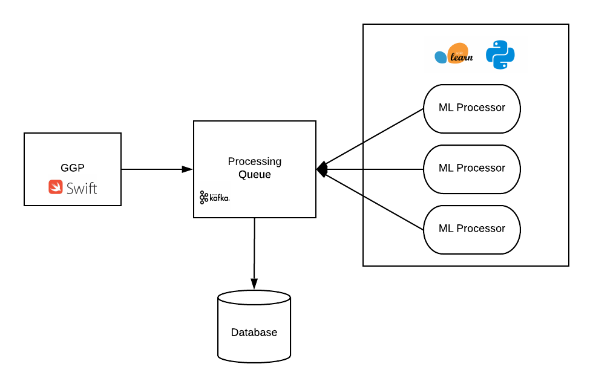

    <h1 align="center">MEANING (<b>M</b>achine l<b>EA</b>r<b>N</b>ing p<b>I</b>peli<b>N</b>e <b>G</b>enerator)</h1>
    <h3>Automatic machine learning pipeline generator </h3>

The architecture followed by this project is presented in the next image:

    

## 1. GGP

The Grammar Genetic Programming module was made using Kotlin as base language

## 2. SK Processor

This is the module to process each individual genrate by the GGP using the framework SKLearn. The module is made using Python
and [Faust](https://faust.readthedocs.io/en/latest/index.html) 

## 3. Kafka

Kafka was chosen as the mediator between the GGP(application that gonna create possible machine learning pipelines) and the consumers (applications
that gonna evaluate the created pipelines)

This project deployed Kafka using Docker, so, the first step is to install Docker on your machine to make it work.