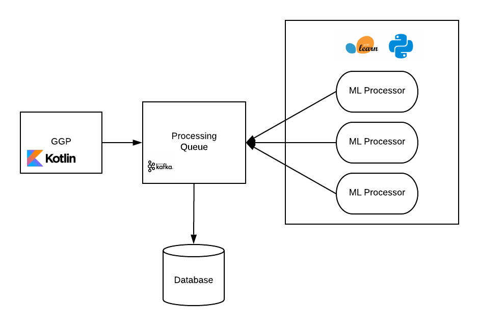

[](https://www.codefactor.io/repository/github/walterjgsp/meaning/overview/master)
[](https://www.codacy.com/manual/walterjgsp/meaning?utm_source=github.com&amp;utm_medium=referral&amp;utm_content=walterjgsp/meaning&amp;utm_campaign=Badge_Grade)

<div align="center">
    <h1 align="center">MEANING (<b>M</b>achine l<b>EA</b>r<b>N</b>ing p<b>I</b>peli<b>N</b>e <b>G</b>enerator)</h1>
    <h3>Automatic machine learning pipeline generator </h3>
</div>

The architecture followed by this project is presented in the next image:

<div align="center">
    
</div>

## 1. GGP

The Grammar Genetic Programming module was made using Swift as base language

## 2. SK Processor

This is the module to process each individual genrate by the GGP using the framework SKLearn. The module is made using Python
and [Faust](https://faust.readthedocs.io/en/latest/index.html) 

## 3. Kafka

Kafka was chosen as the mediator between the GGP(application that gonna create possible machine learning pipelines) and the consumers (applications
that gonna evaluate the created pipelines)

This project deployed Kafka using Docker, so, the first step is to install Docker on your machine to make it work.

### 3.1 Setup

It's necessary to change your IP address on the kafka container to your machine ip.
For unix based SO just run the command 

```bash
ifconfig |grep inet
```

to discover your machine IP. 

Open your file "/etc/hosts" with admin permission and your favorite editor.
Add the following line to the final of this file:

```bash
<YOUR_IP> kafka_server
```

To test if everything worked just use the command

```bash
ping kafka-server
```

and if no package is lost the setup is done

### 3.2 Commands

This sections list important commands for Kafka usage with docker:

To enter the kafka container shell:

```bash
docker exec -it kafka-server /bin/bash
```

Create a producer inside kafka container:

```bash
./kafka-console-producer.sh --broker-list localhost:9092 --topic test
```

And to create the consumer also inside the kafka container:

```bash
./kafka-console-consumer.sh --bootstrap-server localhost:9092 --topic test
```

If you want to test the connection outside the container, there is two scripts
in kafka_scripts folder. One is a producer and the other is a consumer. Execute
them and see if the message is being sent and processed.